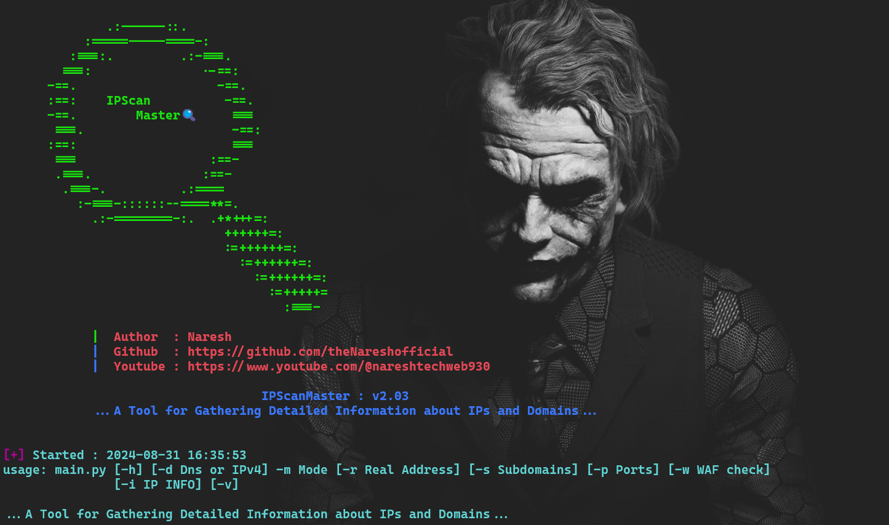

<p align="center">
            
</p>

<h1 align="center">IPScan Master ~ v2.02</h1>

**IPScanMaster** appears to be a network analysis tool with two main functionalities: Scan and Attack. 

The **Scan** mode is designed to gather comprehensive data on IPv4 addresses and DNS names, including original DNS names, port scanning, subdomain discovery, Web Application Firewall (WAF) checks, IP reachability, Dirsearch and WHOIS information. This mode seems to be focused on reconnaissance and information gathering, which is a critical first step in network security assessment.

On the other hand, the **Attack** mode suggests an aggressive approach to identify and exploit vulnerabilities. It mentions utilizing open ports, subdomains, and various tools like Httpx-toolkit, WAF checks for each subdomain, Dirsearch and Nmap for WHOIS information and vulnerability scanning. The output files are saved in a specified directory.

It's important to note that the use of such tools should be conducted ethically and within legal boundaries. Unauthorized scanning or attacking of networks can be illegal and unethical. It's crucial to have permission from the network owner before conducting any scans or tests. Responsible use of IPScanMaster can aid in strengthening network security by identifying vulnerabilities that need to be addressed. Always ensure that your actions comply with local laws and regulations regarding cybersecurity.

# Features 🎯
### Scan
- Check IP Reachability
- Check IP Validate
- Reverse Lookup for Original IP & DNS
- WAF Detection
- Port Scanning
- Dirsearch
- Sub-Domains
- IPINFO.io API Integration
- WHOIS Command Info

### Attack
- Port Scanning
- SubDomain Enumeration
- HTTPX-Toolkit
- WAFW00F Check each sub-domain's
- Wayback Browser History
- Dirsearch
- NMAP --script Whois-Domain
- NMAP --script Whois-IP
- NMAP --script Vulners

# Key Concepts 🔑

## Check IP Reachability
- This function checks if the given IP address responds to ping requests.

## Reverse Lookup for IP & DNS
- This function retrieves the original IP or DNS name. For example, 8.8.8.8 -> dns.google.com.

## WAF Detection
- Checks for the presence of a Web Application Firewall (WAF) on the IP address.

## Port Scanning
- Scans mentioned open ports, covering 85 advanced common ports to identify open ports quickly.

## Wayback
- The Wayback Machine is an online archive that captures snapshots of websites over time, allowing users to view the historical versions of web pages as they appeared on specific dates.

## SubDomain Lister
- This function identifies and lists all subdomains associated with the given domain. This can help in uncovering additional points of entry or services running under the main domain.

## IPINFO.io API
- Retrieves detailed information such as IP, city, region, country, location, organization, and timezone.

## WHOIS
- Executes WHOIS command to fetch additional details about the IP address.

# Usage

**setup.sh**: This script updates and upgrades your Linux system, installs **Python**, **wafw00f**, and other dependencies from **requirements.txt**. It requires sudo and an internet connection.

**main.py**: This script requires an internet connection to scan a wide range of network information about the IP. Ensure you run **setup.sh** before running **main.py** as shown below.

# Installation⤵️

### git clone IPScanMaster
```bash
$ git clone https://github.com/theNareshofficial/IPScanMaster.git
```

### Change Folder IPScanMaster
```bash
$ cd IPScanMaster
```

### Change the permission of setup.sh file
```bash
$ chmod +x setup.sh
```

### Run setup.sh file
```bash
$ sudo ./setup.sh
```

### Run Attack Mode(All)
```bash
$ sudo python main.py -m attack -u example.com
```

### Run Scan Mode(All)
```bash
$ sudo python main.py -m scan -u example.com
```

# Help Option's👇

### Show help
```bash
$ sudo python main.py -h
```

### Show Real Address
```bash
$ sudo python main.py -m scan -r example.com
```

### Show SubDomains
```bash
$ sudo python main.py -m scan -s example.com
```

### Show All Open Port's
```bash
$ sudo python main.py -m scan -p example.com
```

### Web Application Firewall(WAF) Check
```bash
$ sudo python main.py -m scan -f example.com
```

### Wayback Browser History
```bash
$ sudo python main.py -m scan -w example.com
```

### XSS Attack
```bash
$ sudo python main.py -m scan -x example.com
```

### DirSearch
```bash
$ sudo python main.py -m scan -d example.com
```

### IP Information
```bash
$ sudo python main.py -m scan -i example.com
```

### Show version
```bash
$ sudo python main.py -v
```

# Tested OS🧪

- Kali Linux
- Ubuntu OS
- Parrot OS

# Author👨‍💻

- **Name**: Naresh
- **GitHub**: [theNareshofficial](https://github.com/theNareshofficial)
- **Website**: [thenareshofficial.free.nf](http://thenareshofficial.free.nf/)
- **Youtube**: [Naresh tech Web](https://www.youtube.com/@nareshtechweb930)

## Contributing🤝

Please feel free to submit issues or pull requests to improve the functionality and efficiency of this application.


<h1 align="center">ThankYou🎉</h1>