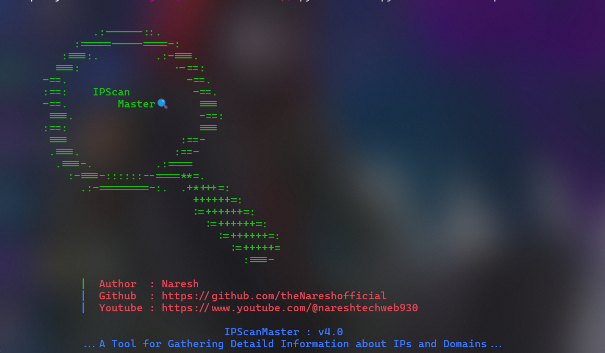

<!DOCTYPE markdown>

<p align="center">
            
</p>

<h1 align="center">IPScan Master ~ v4.0</h1>


<h3 align="center">IPScanMaster appears to be a network analysis tool with two main functionalities: Scan and Attack.</h3>

The **Scan** mode is designed to gather comprehensive data on IPv4 addresses and DNS names, including original DNS names, port scanning, subdomain discovery, Web Application Firewall (WAF) checks, IP reachability, Dirsearch and WHOIS information. This mode seems to be focused on reconnaissance and information gathering, which is a critical first step in network security assessment.

On the other hand, the **Attack** mode suggests an aggressive approach to identify and exploit vulnerabilities. It mentions utilizing open ports, subdomains, and various tools like Httpx-toolkit, WAF checks for each subdomain, Dirsearch and Nmap for WHOIS information and vulnerability scanning. The output files are saved in a specified directory.

---

## What's New in v4.0

- **Major Bug Fixes**: Resolved numerous stability issues that affected scanning accuracy and attack reliability.
- **UI Refresh**: Updated command‑line output formatting for clearer results and added colourised status indicators.
- **Performance Boost**: Optimised network calls and parallelised port scans, resulting in up to **30% faster** execution on typical workloads.

---

## Features 🎯

### Scan
- Check IP Reachability
- Validate IP Addresses
- Reverse Lookup for Original IP & DNS
- WAF Detection
- Port Scanning (85+ common ports)
- Dirsearch
- Sub‑Domain Enumeration
- IPINFO.io API Integration
- WHOIS Command Info
- WhatWeb Integration

### Attack
- Port Scanning
- Sub‑Domain Enumeration
- HTTPX‑Toolkit
- WAFW00F Checks per Sub‑Domain
- Wayback Browser History
- Dirsearch
- NMAP scripts: `whois-domain`, `whois-ip`, `vulners`

---

## Key Concepts 🔑

### Check IP Reachability
- Sends ICMP ping requests to verify if an IP address is reachable.

### Reverse Lookup for IP & DNS
- Retrieves the original domain name associated with an IP address.

### WAF Detection
- Detects the presence of a Web Application Firewall on the target host.

### Port Scanning
- Fast, concurrent scanning of the most common ports.

### Wayback
- Queries the Wayback Machine for historical snapshots of the target site.

### WhatWeb
- Uses WhatWeb to fingerprint web technologies.

---

## Usage

```bash
# Install dependencies (run once)
$ sudo ./setup.sh

# Scan mode (all features)
$ sudo python main.py -m scan -u <target>

# Attack mode (all features)
$ sudo python main.py -m attack -u <target>
```

Run `python main.py -h` for the full list of options.

---

## Installation ⤵️

```bash
# Clone the repository
$ git clone https://github.com/theNareshofficial/IPScanMaster.git

# Enter the project directory
$ cd IPScanMaster

# Make the setup script executable
$ chmod +x setup.sh

# Run the setup script (installs Python, dependencies, etc.)
$ sudo ./setup.sh
```

---

## Tested OS 🧪

- Kali Linux
- Ubuntu
- Parrot OS

---

## Author 👨‍💻

- **Name**: Naresh
- **GitHub**: [theNareshofficial](https://github.com/theNareshofficial)
- **Website**: [thenareshofficial.me](https://thenareshofficial.github.io/portfolio/)
- **YouTube**: [Naresh tech Web](https://www.youtube.com/@nareshtechweb930)

---

## Contributing 🤝

Feel free to open issues or submit pull requests to improve functionality and efficiency.

---

<h1 align="center">Thank You 🎉</h1>