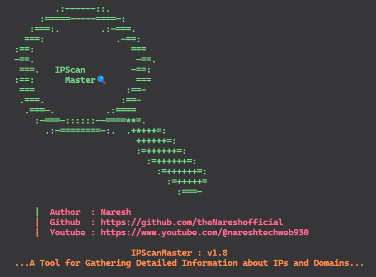

<p align="center">
            
</p>

<h1 align="center">IPScan Master ~ v1.12</h1>

**IPScanMaster** is a tool designed to retrieve detailed information about IPv4 addresses and DNS names, including original DNS names, port scanning, SubDomain's, WAF checks, IP reachability, and WHOIS information. This tool runs on Debian-based Linux OS.

# Features 🎯

- Check IP Reachability
- Check IP Validate
- Reverse Lookup for IP & DNS
- WAF Detection
- Port Scanning
- Sub-Domains
- IPINFO.io API Integration
- WHOIS Command Info

# Key Concepts 🔑

## Check IP Reachability
- This function checks if the given IP address responds to ping requests.

## Reverse Lookup for IP & DNS
- This function retrieves the original IP or DNS name. For example, 8.8.8.8 -> dns.google.com.

## WAF Detection
- Checks for the presence of a Web Application Firewall (WAF) on the IP address.

## Port Scanning
- Scans mentioned open ports, covering 85 advanced common ports to identify open ports quickly.

## SubDomain Lister
- This function identifies and lists all subdomains associated with the given domain. This can help in uncovering additional points of entry or services running under the main domain.

## IPINFO.io API
- Retrieves detailed information such as IP, city, region, country, location, organization, and timezone.

## WHOIS
- Executes WHOIS command to fetch additional details about the IP address.

# Usage

**setup.sh**: This script updates and upgrades your Linux system, installs **Python**, **wafw00f**, and other dependencies from **requirements.txt**. It requires sudo and an internet connection.

**main.py**: This script requires an internet connection to scan a wide range of network information about the IP. Ensure you run **setup.sh** before running **main.py** as shown below.

# Installation⤵️

```bash
# git clone IPScanMaster
$ git clone https://github.com/theNareshofficial/IPScanMaster.git

# Change Folder IPScanMaster
$ cd IPScanMaster

# Change the permission of setup.sh file
$ chmod +x setup.sh

# Run setup.sh file
$ sudo ./setup.sh

# Run main.py file
$ python main.py
```

# Tested OS🧪

- Kali Linux
- Ubuntu OS
- Parrot OS

# Author👨‍💻

- **Name**: Naresh
- **GitHub**: [theNareshofficial](https://github.com/theNareshofficial)
- **Website**: [thenareshofficial.free.nf](http://thenareshofficial.free.nf/)
- **Youtube**: [Naresh tech Web](https://www.youtube.com/@nareshtechweb930)

## Contributing🤝

Please feel free to submit issues or pull requests to improve the functionality and efficiency of this application.


<h1 align="center">ThankYou🎉</h1>